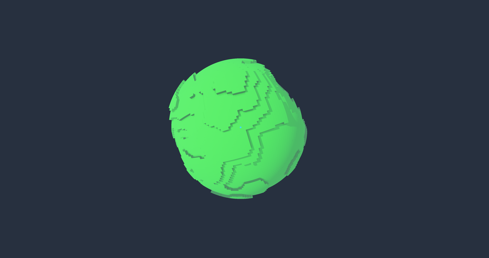

  

---

## Key Features

This project is a high-performance voxel engine built from scratch in **Rust**, capable of generating fully explorable, spherical planets in real-time.

*   **Spherical Terrain:** Generates a massive, round planet using advanced coordinate mapping (Nowell's Algorithm), eliminating the distortion found in standard cube-map projections.
*   **Multithreaded & Async:** Heavy computational tasks like noise generation and mesh tessellation are offloaded to background thread pools, ensuring a buttery-smooth frame rate.
*   **Custom Rendering Engine:** Powered by **wgpu**, featuring cascaded shadow maps, exponential atmospheric fog, and HDR tone mapping for photorealistic visuals.
*   **Dynamic LOD System:** Implements a recursive Quadtree-based Level of Detail system that renders high-fidelity voxels near the player while optimizing geometry at the horizon.
*   **Custom Physics Engine:** A specialized physics solver designed for spherical gravity, handling collision detection and character orientation on a curved surface.

## Deep Dive for Those Interested

### 1. Core Architecture & Memory Management (System Design)
The engine is built on a **multithreaded ECS-like architecture** designed for high-throughput procedural generation, prioritizing thread safety and zero-cost abstractions.

*   **Asynchronous Mesh Streaming:** Utilizing Rust’s `std::sync::mpsc` channels, I implemented a non-blocking "producer-consumer" model. Heavy operations—specifically Perlin noise generation and vertex tessellation—occur on background thread pools.
*   **Zero-Copy GPU Uploads:** Leveraged the `bytemuck` crate to cast complex internal structs directly into raw byte slices, minimizing CPU overhead during `wgpu::Queue::write_buffer` operations.
*   **Dynamic Resource Management:** Implemented a reference-counted memory system for voxel data, utilizing `HashMap` lookups with spatial hashing (`ChunkKey`) to efficiently manage sparse voxel data across the spherical grid.

### 2. Advanced Rendering Pipeline (Graphics Programming)
The rendering pipeline is constructed using **wgpu (WebGPU)**, featuring a custom WGSL shader pipeline focused on visual fidelity and artifact reduction.

*   **Stable Cascaded Shadow Mapping (Texel Snapping):**
    To solve the "shadow shimmering" artifact caused by camera movement in directional light sources, I implemented **orthographic texel snapping**. The light's view matrix translation is quantized to align perfectly with the shadow map's texel grid size:

$$
x_{snapped} = \left\lfloor \frac{x}{texel\_size} \right\rfloor \cdot texel\_size
$$

    This ensures that as the camera moves, the shadow map projection matrix only moves in discrete texel increments, keeping shadow edges static relative to world geometry.

*   **PCF (Percentage-Closer Filtering):** Implemented a 5x5 Gaussian-weighted kernel in the fragment shader to produce soft, realistic penumbras.

*   **Atmospheric Scattering & Tone Mapping:**
    *   Implemented an **Exponential Squared Fog** model ($\displaystyle e^{-(d \cdot \rho)^2}$) to simulate atmospheric depth.
    *   Applied **ACES** approximation for HDR to LDR tone mapping.

*   **Transparency Dithering:** Instead of expensive alpha sorting (which is $\displaystyle O(n \log n)$), I utilized an **Ordered Dithering Matrix** in the fragment shader. This allows for $\displaystyle O(1)$ transparency rendering.

### 3. Spherical Geometry & LOD Algorithms (Math & Terrain)
Unlike standard planar terrain engines, this system generates a fully explorable planet, requiring non-Euclidean mapping techniques.

*   **Cube-to-Sphere Mapping:**
    Implemented the **Nowell Mapping algorithm** to project the voxel grid onto a sphere with minimal distortion. This transforms a unit cube coordinate $(x, y, z)$ into a spherical vector $(x', y', z')$:

$$
x' = x \sqrt{1 - \frac{y^2}{2} - \frac{z^2}{2} + \frac{y^2z^2}{3}}
$$

    This ensures uniform voxel distribution across the planet's surface, solving the "corner clustering" problem found in standard normalization approaches.

*   **Quadtree Spatial Partitioning:**
    Designed a recursive Quadtree algorithm for **Level of Detail (LOD)** management. The system recursively subdivides the planet surface based on the camera's distance relative to the chunk's arc length:
    *   *Heuristic:* `Split if (distance < radius * lod_factor)`
    *   This allows rendering high-resolution voxels near the player while seamlessly transitioning to simplified terrain meshes at the horizon to maintain performance.

*   **Skirt Generation:** To prevent visual "cracks" (T-junction artifacts) between chunks of different LOD levels, the meshing algorithm automatically generates **"skirts"**—geometry extending inwards at chunk borders.

### 4. Physics & Simulation (Custom Solver)
Since the world is spherical, standard physics engines are insufficient as they typically assume a constant gravity vector $\vec{g} = (0, -9.81, 0)$.

*   **Spherical Gravity Alignment:**
    Implemented a kinematic character controller where the "Up" vector is constantly recalculated based on the entity's position relative to the planet center:

$$
\vec{UP} = \text{normalize}(\vec{Position})
$$

*   **Quaternion-Based Orientation:**
    Used quaternion rotation arcs (`Quat::from_rotation_arc`) to smoothly interpolate the player's local coordinate system to match the planet's curvature in real-time.

*   **Discrete Collision Detection:**
    Wrote a custom **AABB** solver that checks for voxel occupancy by casting rays into the underlying math-based terrain grid.
